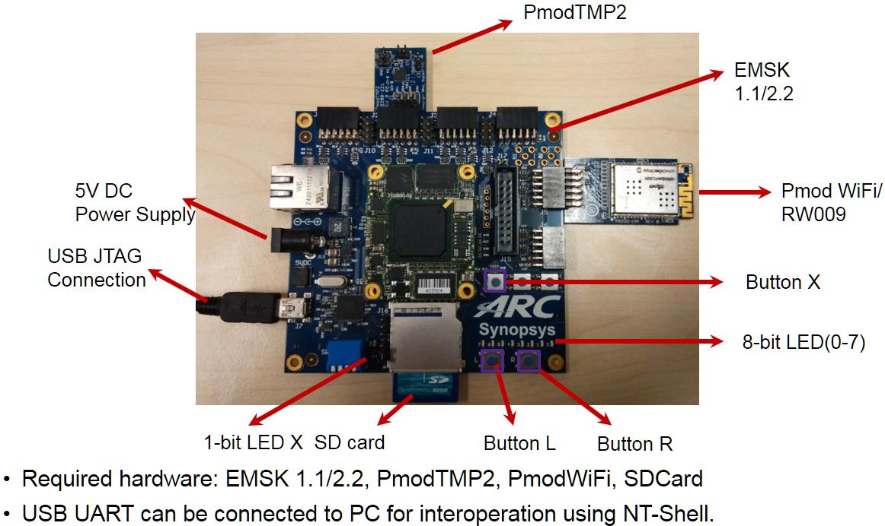
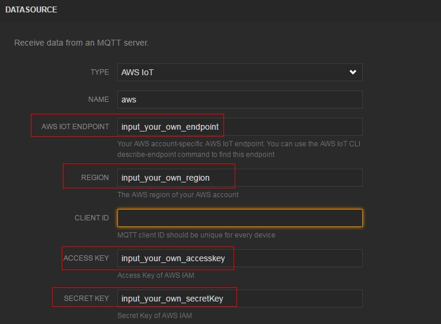
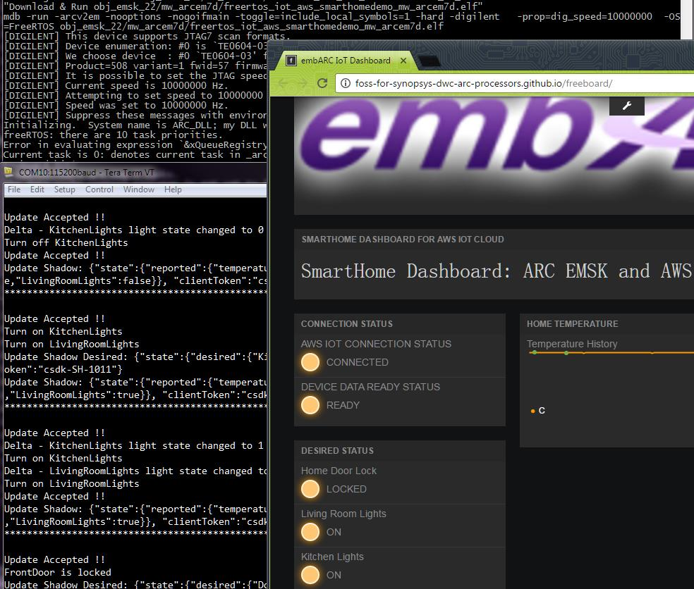
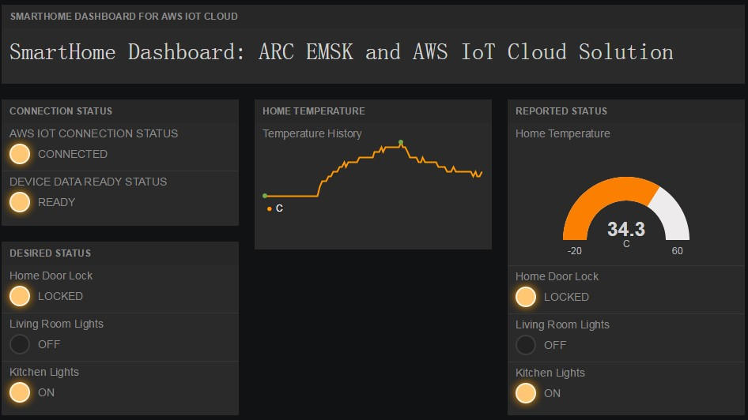

# AWS IoT Smarthome Application
This application is designed to show how to connect only 1 EMSK and [AWS IoT Cloud](https://aws.amazon.com/iot/?nc1=h_ls) using embARC. The connection between EMSK and AWS IoT Cloud is secured by TLS.

## Hardware and Software Setup
### Required Hardware
- [DesignWare ARC EM Starter Kit(EMSK)](https://www.synopsys.com/dw/ipdir.php?ds=arc_em_starter_kit)
- [Digilent PMOD WiFi(MRF24WG0MA)](http://store.digilentinc.com/pmodwifi-wifi-interface-802-11g/)
- [Digilent PMOD TMP2](http://store.digilentinc.com/pmod-tmp2-temperature-sensor/)
- SD Card
- WiFi Hotspot(SSID:**embARC**, Password:**qazwsxedc**, WPA/WPA2 encypted)

### Required Software
- Metaware or ARC GNU Toolset
- Serial port terminal, such as putty, tera-term or minicom

### Hardware Connection
1. Connect PMOD WiFi to J5, connect PMOD TMP2 to J2.
   

2. Configure your hardware with proper core configuration.

## User Manual
### Before running this application
Prepare you own AWS IoT account, and create required thing.
Before compiling this example, you need to change macro **AWS_IOT_MQTT_HOST** in `src/aws_iot_config.h` to your own aws iot cloud mqtt host, and create an aws iot thing named **SmartHome**, you can refer to [Gettting Started with AWS IoT](https://docs.aws.amazon.com/iot/latest/developerguide/iot-gs.html) for details, and generate certificates and download them and rename them to the ones under `src/cert/smarthome/`.

We also provided an application note about [Using a Smart Home Iot Application with EMSK](https://www.embarc.org/pdf/embARC_appnote_how_to_use_smart_home_iot.pdf).

Copy `src/cert/` folder to root folder of the EMSK SD card, in SD card, the cert folder should be `cert/`.

The hardware resources are allocated as following table.

|  Hardware Resource  |            Represent                                          |
| ------------------- | ------------------------------------------------------------- |
|  BUTTON R           | Livingroom Lights Control                                     |
|  LED 0-1            | Livingroom Lights Status(On or Off)                           |
|  BUTTON L           | Kitchen Lights Control                                        |
|  LED 2-3            | Kitchen Lights Status(On or Off)                              |
|  BUTTON X           | Front Door Lock Control                                       |
|  LED 4-5            | Front Door Lock Status(On or Off)                             |
|  LED 7              | WiFi connection status(On for connected, Off for not)         |
|  LED X              | Node working status(toggling in 2s period if working well)    |
|  PMOD TMP2          | Temperature Sensor                                            |
|  PMOD WiFi          | Provide WiFi Connection                                       |

EMSK can send the status of the Room Temperature, FrontDoor Lock status, LivingRoom Light status and Kitchen Light status to the AWS IoT and interact with AWS IoT Cloud with using embARC.

Open [dashboard website](http://foss-for-synopsys-dwc-arc-processors.github.io/freeboard/), and load `dashboard-smarthome-singlething.json` dashboard configuration file in current folder, and then you can control and monitor this single node.

After loading this configuration file, you also need to click at the setting icon, and then click on the aws datasource, and then change the **AWS IOT ENDPOINT**, **REGION**, **ACCESS KEY**, **SECRET KEY** to your own aws ones.



The JSON Document in the AWS IoT cloud is shown below.
```json
   {
     "reported": {
       "temperature": 0.00,
       "DoorLocked": false,
       "KitchenLights": false,
       "LivingRoomLights": false
     },
     "desired": {
       "DoorLocked": false,
       "KitchenLights": false,
       "LivingRoomLights": false
     }
   }
```

### Run this application
Here take **EMSK2.2 - ARC EM7D** with Metaware Toolset for example to show how to run this application.

1. Open Windows or Linux terminal, and cd to `src` folder.

2. To build this applicaiton, select the proper board version, core configuration and build with selected toolchain using this command `gmake BD_VER=22 CUR_CORE=arcem7d TOOLCHAIN=mw` :
  ```
  embarc_osp\application\aws_iot_smarthome\src>gmake BD_VER=22 CUR_CORE=arcem7d TOOLCHAIN=mw
  "Creating Directory : " obj_emsk_22/mw_arcem7d
  "Compiling          : " main.c
  "Compiling          : " ../../../board/board.c
  "Creating Directory : " obj_emsk_22/mw_arcem7d/emsk
  "Compiling          : " ../../../device/designware/iic/dw_iic.c
  "Compiling          : " ../../../device/designware/spi/dw_spi.c
  ... ...
  "Archiving          : " obj_emsk_22/mw_arcem7d/liblibclib.a
  "Archiving          : " obj_emsk_22/mw_arcem7d/libembarc.a
  "Linking            : " obj_emsk_22/mw_arcem7d/freertos_iot_aws_smarthomedemo_mw_arcem7d.elf
  ```
  All object files are generated under the `obj_emsk_22/mw_arcem7d` folder according to your choice.
  The application elf file is also generated in that folder.

3. Connect PMOD WiFi to J5, PMOD TMP2 to J2.

4. Plug the USB cable into the J7 port(JTAG and USB-UART) on EMSK, power on the board, and setup your WiFi hotspot.

5. Configure the EMSK 2.2 to ARC EM7D core by setting the dip switch bit 1-2 all to OFF, then reload the core configuration by press the button above **C** character on board.

6. Open your serial terminal such as Tera-Term on PC, and configure it to right COM port and *115200bps*.

7. Run this application using this command `gmake BD_VER=22 CUR_CORE=arcem7d TOOLCHAIN=mw run` :
  

8. Interact using EMSK and Dashboard.
  - You can press the **button L/R/X** to see the led changes on board and also on dashboard web app.
  - You can also click the lights of **DESIRED STATUS** pane on the dashboard app, and see the led changes on board and dashboard web app.
  
